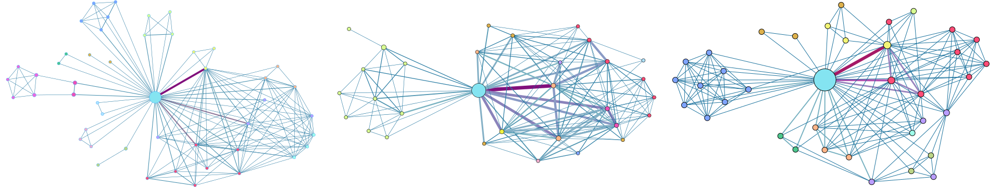

# Filmadaptionen in der Netzwerkanalyse – Eine Betrachtung anhand zweier Verfilmungen von »Alice’s Adventures in Wonderland«

Überblick über die Dateien/Ordner:

- `film-2010.ipnb`. Jupyter Notebook für den automatisierten Download und Extraktion des Films von Tim Burton. 
- `ratio-comparision.ipynb`. Jupyter Notebook für den Vergleich der Gewichte zweier Netzwerke.
- `comparision`. Verhältnisnetzwerke zwischen zwei Figurennetzwerke generiert mit `ratio-comparision.ipynb`.
- `gephi`. Gephidateien der drei Netzwerke.
- `pdf`. PDF-Exporte der Netzwerke.
